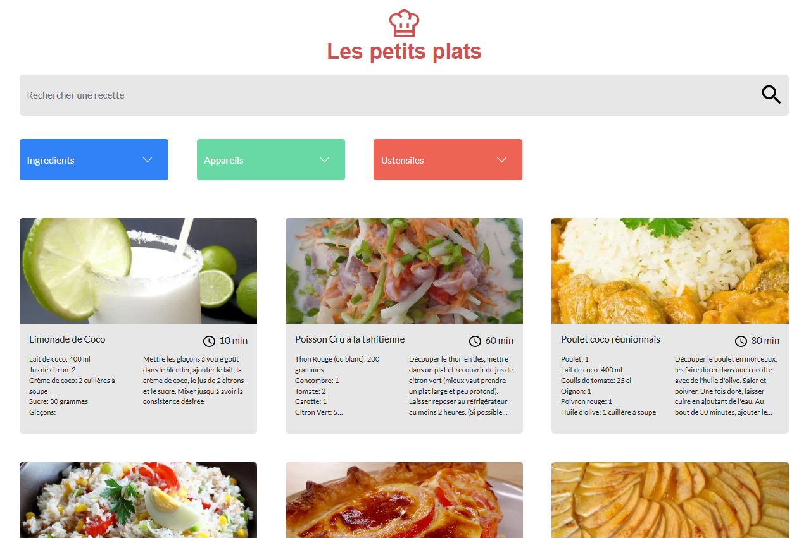

# Développez un algorithme de recherche en JavaScript

  

## Technos

  

Utilisation de `Bootstrap 5.2.3` pour le design et `Figma` pour la maquette. 
Utilisation de `GitHub` pour le versionning et `Vercel` pour le déploiement. 
Utilisation du pattern `MVC` pour la structure du projet. 
Projet orienté `Objet` avec utilisation de `Classes` et `Constructeurs`.

---

  

